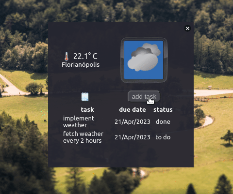

# Sunny-Do ☀️ 
## To-Do Weather Widget

This is a simple desktop weather app built using ElectronJS, ipapi.co and OpenWeatherMap APIs. 
App built with a lot of passion ❤️  
Just wanted to learn ElectronJS and the ideas keep coming... there is more stuff to do, but guess the progress is about 75%  
hope you like it! 🤙

## Features

- Automatically get the current weather information for your City based on location
- Display the weather icon corresponding to the current weather condition
- Drag and drop the window anywhere on the desktop
- Add tasks to-do and change it's status like 'to do', 'in progress' and 'done'

## Installation

...more info and installers soon

## Usage

To use the app, follow these steps:

1. Create an OpenWeather FREE account to get a API KEY. 
2. Enter the API KEY in the txt file.
3. Run the App.
4. The current weather information for the city will be displayed along with an icon representing the current weather condition.
5. You can drag and drop the window to any position on your desktop.
6. You can add tasks to keep on track of those amazing projects you're up to!

## Screencapture

isn't that frameless transparent window gorgeous? what about that nostalgic frame?
## Credits

- [Electron](https://www.electronjs.org/) - Desktop app framework
- [OpenWeatherMap API](https://openweathermap.org/api) - Weather data API
- [ipapi](https://ipapi.co/developers/) - IP information API

## License

This project is licensed under the MIT License - see the [LICENSE.md](LICENSE.md) file for details.

## Work in progress:

### functionality:
- ✔️ close btns (done)
- ✔️ validate new task attrs (done)
- ✔️ validate tasks[] (done)
- ✔️ location field to request on api (done)
- ✔️ implement weather forecast api (done)
- ✔️ prevent multiple add-task windows (done)
- ❗ change task status
- ❗ quick done or delete action
- ❗ save tasks[] to json file
- ❗ load var API_KEY from txt file
- ✏️ fetch weather every 2 hours
- ✔️ unlock window (done)

### styling:
- ✔️ fix paddings and spacings (done)
- ✔️ center components on window (done)
- ✔️ try to round corners to look like a widget (done, except for linux)
- ❗ better display/render of task list (make just the list scrollable)
- ✏️ add app icon
- ✔️ use images (svg) to render forecasts (done)
